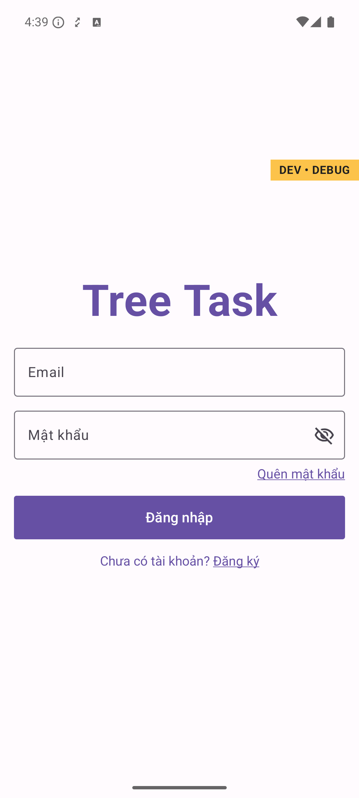
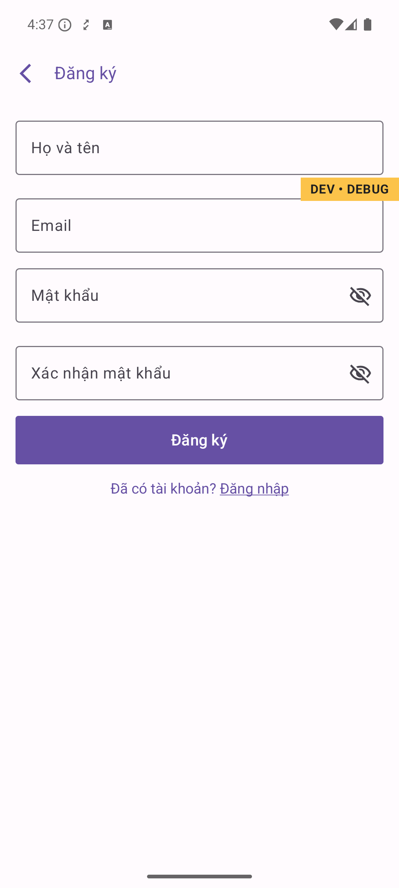
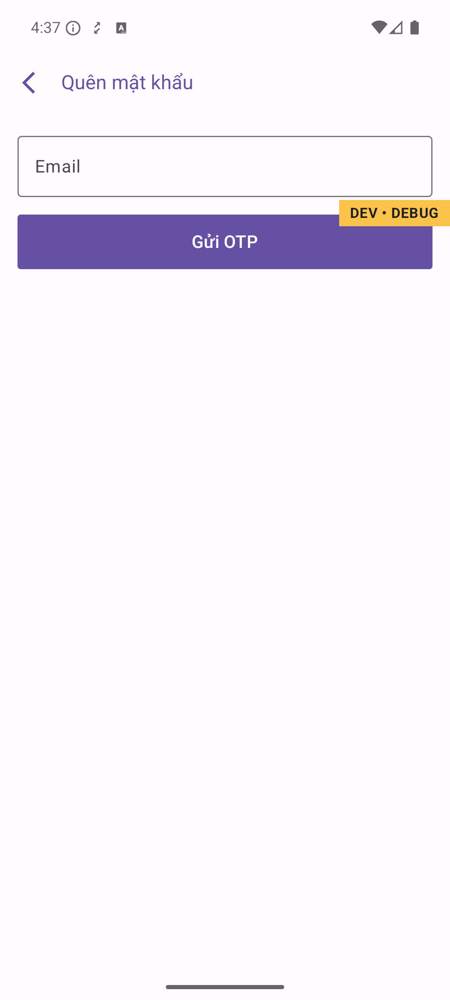
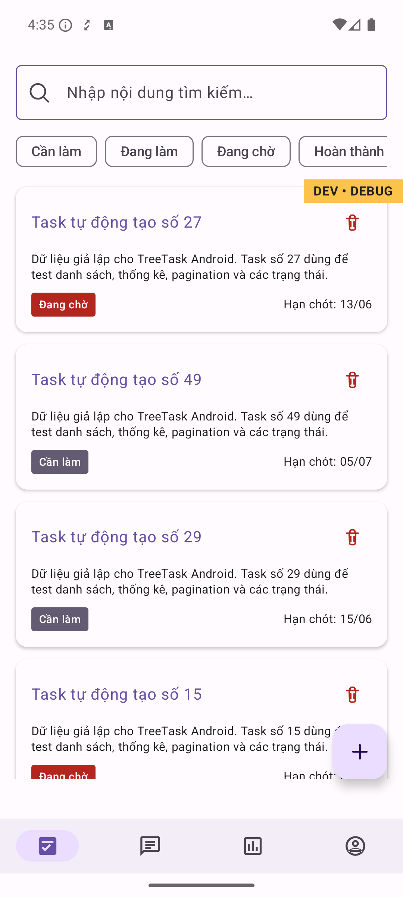
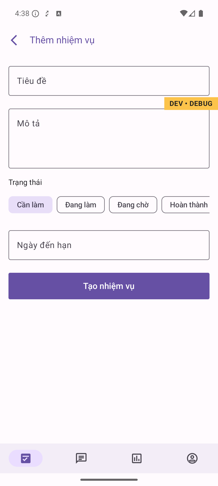
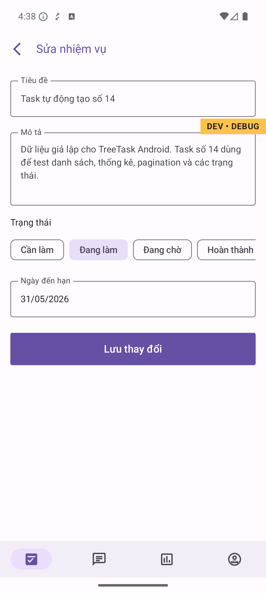
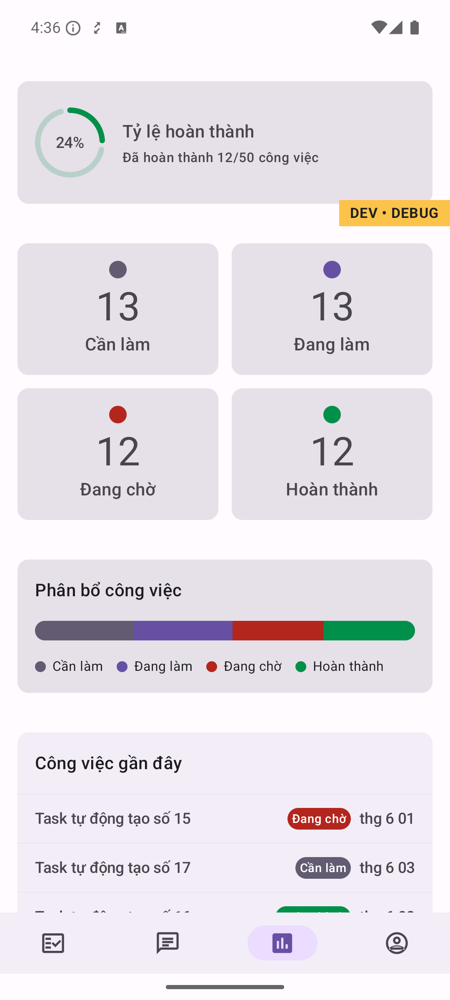

# TreeTask - Android Task Management App

A modern, offline-first Android Task Management application built using **Clean Architecture**, **MVI Pattern**, and heavily inspired by Google's official **Now in Android** (NiA) architecture.

## 📸 Screenshots

> Replace the images below with actual screenshots after capturing from a device or emulator.
> Recommended: `adb exec-out screencap -p > docs/screenshots/<name>.png`

### Authentication

| Login | Register | Forgot Password |
|:---:|:---:|:---:|
|  |  |  |

### Tasks

| Task List | Add Task | Edit / View Task |
|:---:|:---:|:---:|
|  |  |  |

### Stats

| Stats Overview |
|:---:|
|  |

### Profile

| Profile | Language Picker |
|:---:|:---:|
|  |  |

---

## 🏗 Architecture & Tech Stack

This project follows a highly modularized architecture to ensure scalability, robust testing, and separation of concerns.

* **Architecture**: Clean Architecture, Multi-module, MVI (Model-View-Intent)
* **Language**: Kotlin 2.0+
* **UI**: Jetpack Compose (Material 3)
* **Dependency Injection**: Hilt
* **Asynchronous Programming**: Kotlin Coroutines & Flow
* **Networking**: Retrofit2, OkHttp, Kotlinx Serialization, Socket.IO (planned)
* **Local Storage**: Room Database (Offline-first data layer), Preferences DataStore
* **Testing**: JUnit4, MockK, Turbine, Truth, Coroutines-Test
* **Observability**: Firebase Analytics, Firebase Crashlytics, Firebase Performance, LeakCanary
* **CI/CD**: GitHub Actions (Lint, Detekt, Automated Unit Tests)
* **Localization**: Multi-language support (English & Vietnamese)
* **Security & Optimization**: R8/ProGuard obfuscation, EncryptedSharedPreferences (planned)

## 📦 Key Features

* **Authentication**: Login, Register, Forgot Password with OTP verification. Automatic token refresh via OkHttp Interceptors. Forced logout and backstack clearing on session expiry.
* **Task Management**: Create, edit, view, and delete tasks. Filter by status (Todo / In Progress / Pending / Done). Swipe-to-delete with confirmation dialog. Paginated list via Paging 3 + `RemoteMediator`.
* **Stats Dashboard**: Completion rate ring, status breakdown grid, workload bar, and recent task feed.
* **Profile & Settings**: Language picker (EN / VI) with system-default fallback.
* **Offline-first Sync**: Room + `RemoteMediator` syncs with REST API; works offline and reconciles on reconnect.
* **Real-time Network Monitor**: Offline banner reacts to connectivity changes.
* **Localization (i18n)**: Fully translated for English and Vietnamese.
* **Observability**: Custom analytics events, non-fatal error reporting via Firebase Crashlytics, LeakCanary in debug builds.
* **Code Quality**: Detekt static analysis, Spotless formatting, CI via GitHub Actions.

## 🚀 Setup Instructions

To build and run this project on your local machine:

1. **Clone the repository**:
   ```bash
   git clone https://github.com/doannd3/TreeTask.git
   ```

2. **Open the project**:
   Open the cloned directory in **Android Studio Ladybug** (or a newer version).

3. **Configure Firebase**:
   Place your `google-services.json` file into the `app/` directory to enable Analytics, Performance, and Crashlytics.

4. **Build and Run**:
   Sync the Gradle project and click the Run button.

## 🔮 Roadmap

* **Real-time Chat**: Socket.IO stream wired to the Compose UI layer.
* **Notification Preferences**: Granular notification controls in Settings.
* **Dark Mode Toggle**: User-controlled theme override.
* **Task Scheduling**: Recurring tasks and calendar-based scheduling.

---
*This README is continuously updated as new features ship.*
